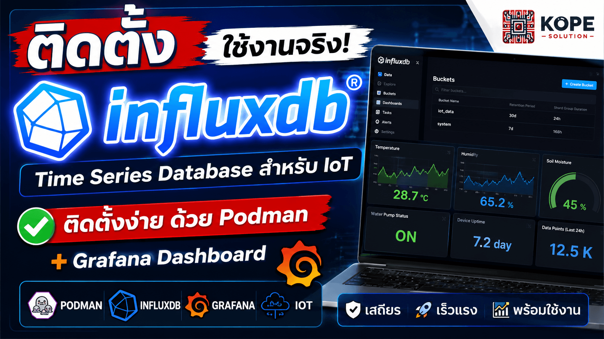
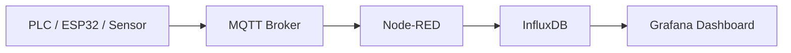

# InfluxDB for IoT Monitoring — Installation Guide

ติดตั้ง InfluxDB สำหรับงาน IoT Monitoring, Smart Farm, Smart Factory และ Industrial Data Logging



---

# Overview

Repository นี้เป็นส่วนหนึ่งของซีรีส์สอนใช้งาน InfluxDB สำหรับงาน:
- Smart Farm
- Smart Factory
- Industrial IoT (IIoT)
- Energy Monitoring
- Sensor Data Logging
- Real-Time Dashboard
- MQTT + Node-RED + Grafana
- Time-Series Database

ในส่วนนี้จะเน้นเฉพาะ:
- การติดตั้ง InfluxDB  
- การรันผ่าน Podman  
- การสร้าง Persistent Storage  
- การเปิดใช้งานผ่าน Web UI  
- การเตรียมระบบสำหรับเชื่อมต่อ Grafana และ Node-RED ในส่วนถัดไป

---

# What is InfluxDB?

InfluxDB คือ Time-Series Database ที่ออกแบบมาสำหรับเก็บข้อมูลตามเวลา (Timestamp)

เหมาะกับ:
- Sensor Data
- PLC Data
- MQTT Telemetry
- Temperature / Humidity
- Energy Monitoring
- Industrial Monitoring
- SCADA / IIoT
- AIoT

ตัวอย่างข้อมูล:
- อุณหภูมิ
- ความชื้น
- กระแสไฟฟ้า
- แรงดัน
- Flow
- Pressure
- Machine Status
- Production Data

---

# Architecture


---

# Why InfluxDB?

ข้อดี:
- เร็วมากสำหรับ Time-Series Data
- เหมาะกับ IoT และ Monitoring
- ใช้งานร่วมกับ Grafana ได้ดีมาก
- Query ข้อมูลตามเวลาได้ง่าย
- รองรับ Data Retention
- เหมาะกับ Real-Time Dashboard
- ใช้ Resource ไม่สูงมาก
- นิยมในงาน Industry และ Energy

---

# Environment

ตัวอย่าง Environment ที่ใช้:

| Component | Version |
|---|---|
| OS | Ubuntu / WSL Ubuntu |
| Container | Podman |
| InfluxDB | Latest |
| Dashboard | Grafana |
| Flow | Node-RED |

---

# Install Podman

## Ubuntu / WSL Ubuntu

```bash
sudo apt update
sudo apt install podman -y
```

ตรวจสอบเวอร์ชัน:

```bash
podman --version
```

---

# Create Volume Directory

สร้าง Folder สำหรับเก็บข้อมูล:

```bash
mkdir -p ~/influxdb-data
chmod 777 ~/influxdb-data
```

---

# Pull InfluxDB Image

```bash
podman pull docker.io/library/influxdb:3-core
```

---

# Run InfluxDB Container

```bash
podman run -d \
  --name influxdb \
  -p 8086:8086 \
  -v ~/influxdb-data:/var/lib/influxdb3:Z \
  --restart=unless-stopped \
  docker.io/library/influxdb:3-core
```

---

# Check Container

```bash
podman ps
```

ตัวอย่าง:

```text
CONTAINER ID  IMAGE                              STATUS
xxxxxxxxxxxx  docker.io/library/influxdb:latest Up 10 seconds
```

---

# Open InfluxDB Web UI

เปิด Browser:

```text
http://localhost:8086
```

หรือ:

```text
http://SERVER-IP:8086
```

---

# First-Time Setup

เมื่อเข้า Web UI ครั้งแรก:

ให้สร้าง:

- Username
- Password
- Organization
- Bucket

ตัวอย่าง:

| Field | Example |
|---|---|
| Username | admin |
| Password | admin123 |
| Organization | KOPE-SOLUTION |
| Bucket | smartfactory |

---

# Generate API Token

หลัง Setup เสร็จ: InfluxDB จะสร้าง API Token

**สำคัญมาก** ⚠️

ให้ Copy เก็บไว้ เพราะจะใช้ใน:
- Node-RED
- Grafana
- API
- Python
- MQTT Pipeline

---

# Test Access

ตรวจสอบว่า InfluxDB ทำงาน:

```bash
curl http://localhost:8086/health
```

ถ้าปกติจะได้:

```json
{
  "status":"pass"
}
```

---

# Stop Container

```bash
podman stop influxdb
```

---

# Start Container

```bash
podman start influxdb
```

---

# Remove Container

```bash
podman rm -f influxdb
```

---

# Remove Data

⚠️ ระวัง: คำสั่งนี้จะลบข้อมูลทั้งหมด

```bash
rm -rf ~/influxdb-data
```

---

# Example Use Cases

## Smart Farm

- Temperature Monitoring
- Soil Moisture
- Water Pump Monitoring
- Greenhouse Dashboard

## Smart Factory

- Machine Status
- Production Counter
- Motor Temperature
- Energy Monitoring
- Predictive Maintenance

## Smart CCTV

- AI Camera Monitoring
- Motion Detection Events
- CCTV Status Dashboard
- Intrusion Detection
- License Plate Recognition (LPR)

## Smart Home

- Smart Lighting Monitoring
- Door / Window Sensor Logging
- Smart Plug Energy Monitoring
- Home Security Dashboard
- Temperature & Humidity Monitoring

## Smart City

- Traffic Monitoring
- Smart Parking Dashboard
- Air Quality Monitoring
- Flood Monitoring System
- Public Lighting Monitoring

## Energy Monitoring

- Solar Monitoring
- Power Meter
- Current / Voltage Logging
- Battery Monitoring

---

# KOPE SOLUTION

Content:
- Embedded Systems
- ESP32
- PLC
- IoT
- IIoT
- AIoT
- Data Engineering
- Grafana
- MQTT
- Node-RED
- InfluxDB
- Industrial Monitoring
